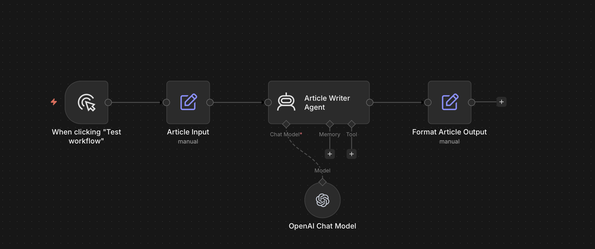

# n8n AI Writing System

I built this using n8n to explore something practical:

What happens when you don’t outsource the thinking, but you structure it?

This workflow takes a topic and turns it into a full-length article. The point is not speed or content volume. It’s to keep the thinking process intact while using AI as a second pass, not a replacement.

## What it does

- Takes a topic and category as input  
- Generates a long-form article in a consistent voice  
- Outputs structured content (title, body, metadata, slug)

## Why I built it

Most AI writing tools optimise for polish. They remove friction too early.

This system keeps some of that friction. It produces a draft, but still expects the writer to step in, question it, and reshape it.

## Workflow

## Example

**Topic:** How AI is changing human thinking — and why we risk losing agency  

**Category:** AI & Cognition  

**Excerpt:**

The other morning I found myself asking a small question out loud, as if the apartment could answer back. I was making coffee, the kettle ticking, and I wanted to know whether a paper I remembered reading last year had been contradicted since...

Built using n8n.
